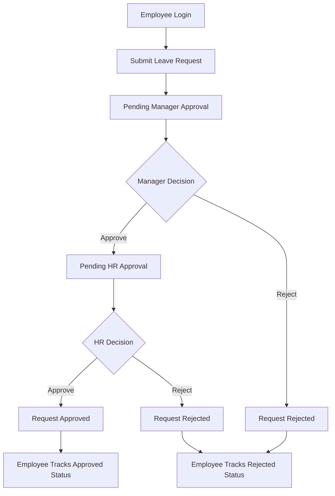

# AutoForm - Workflow Automation System

## Overview

AutoForm is a workflow automation web application developed to simplify employee request management inside an organization. The system allows employees to submit requests such as leave applications, permission requests, and IT support requests. Managers and HR personnel can review, approve, or reject requests through separate dashboards.

## Features

### Employee Features  
-User Registration and Login  
-Submit Leave Requests  
-Submit Permission Requests  
-Submit IT Support Requests  
-Track Request Status  
-Submit Feedback  

### Manager Features  
-Separate Manager Dashboard  
-View Pending Employee Requests  
-Approve Requests  
-Reject Requests  

### HR Features
-Separate HR Dashboard  
-View Manager Approved Requests  
-Final Approval or Rejection  

## Workflow  

## Workflow Diagram

## Technologies used 

HTML  
CSS  
JavaScript  
Local storage   

## Note   

This project uses browser LocalStorage

